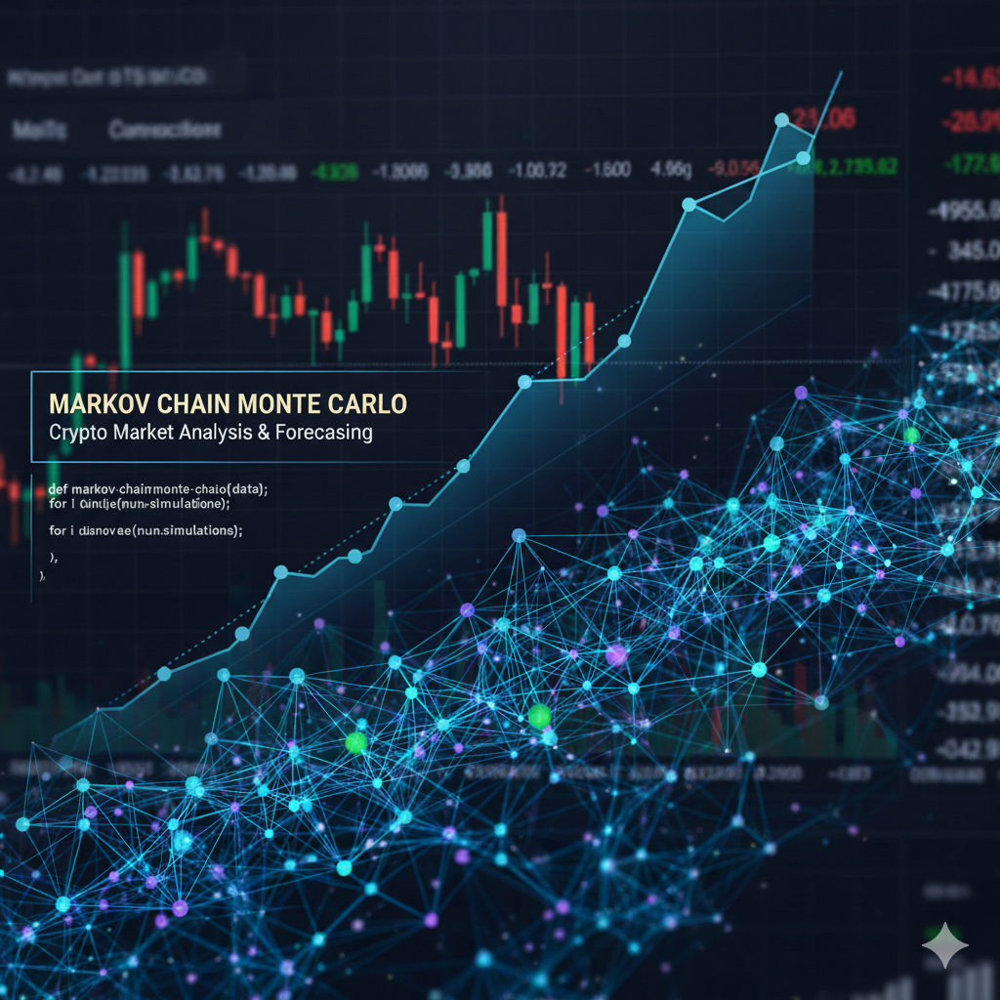

# CryptoForecaster

A production-grade Python package for pulling cryptocurrency market data, storing it in **DuckDB**, and training + deploying **time-series forecasting models** (Prophet, ARIMA, Ensemble) to predict prices in USD.

> NOTE: I'm currently reviewing code and syncing to Github as I go. Until this note is removed, the tool will not function.

<p align="center">
  
</p>


---

## Features

| Feature | Detail |
|---|---|
| **Data Ingestion** | CoinGecko public API — no API key needed |
| **Coins supported** | BTC, ETH, BNB, SOL, XRP, ADA, DOGE, AVAX, DOT, LINK (configurable) |
| **Storage** | DuckDB — fast embedded analytics database |
| **Models** | Prophet, SARIMA, Inverse-MAPE Weighted Ensemble |
| **Forecast output** | Point forecast + 95% prediction intervals for every time point |
| **CLI** | Full Typer CLI — `cryptoforecaster pipeline` runs everything |
| **Visualisation** | Interactive Plotly charts |


### Python API

```python
from cryptoforecaster.pipeline import run_pipeline

# One call: ingest → train → forecast
forecasts = run_pipeline(
    coins=["bitcoin", "ethereum"],
    days=365,
    model_name="ensemble",   # "prophet" | "arima" | "ensemble"
    horizon=30,
)

btc = forecasts["bitcoin"]
print(btc[btc["is_future"]].head())
```

### Step-by-step

```python
from cryptoforecaster.ingestion.fetcher    import CryptoFetcher
from cryptoforecaster.storage.database    import CryptoDatabase
from cryptoforecaster.modeling.trainer    import ForecastTrainer
from cryptoforecaster.forecasting.predictor import ForecastPredictor
from cryptoforecaster.utils.visualizer    import ForecastVisualizer

# 1. Ingest
db      = CryptoDatabase()
fetcher = CryptoFetcher()
data    = fetcher.fetch_all(coin_ids=["bitcoin"], days=365)
db.upsert_market_prices(data["market_charts"])

# 2. Train
trainer = ForecastTrainer(db=db, model_name="prophet")
model   = trainer.train("bitcoin")

# 3. Forecast
predictor = ForecastPredictor(db=db, horizon=30)
fc_df     = predictor.forecast("bitcoin")

# 4. Visualise
viz = ForecastVisualizer()
fig = viz.plot_forecast(fc_df, coin_id="bitcoin")
fig.show()
```

---

## CLI

```bash
# Full pipeline
cryptoforecaster pipeline --coins bitcoin,ethereum --model ensemble --horizon 30

# Individual steps
cryptoforecaster ingest  --coins bitcoin,ethereum --days 365
cryptoforecaster train   --coins bitcoin,ethereum --model prophet
cryptoforecaster predict --coins bitcoin,ethereum --horizon 30

# DB summary
cryptoforecaster summary
```

---

## Architecture

```
cryptoforecaster/
├── ingestion/
│   └── fetcher.py          # CoinGecko HTTP client
├── storage/
│   └── database.py         # DuckDB schema + upsert helpers
├── modeling/
│   ├── base.py             # Abstract BaseModel
│   ├── prophet_model.py    # Facebook Prophet
│   ├── arima_model.py      # SARIMA (statsmodels)
│   ├── ensemble.py         # Inverse-MAPE weighted blend
│   └── trainer.py          # Train + evaluate + persist
├── forecasting/
│   └── predictor.py        # Load model → run inference → store
├── utils/
│   ├── logger.py           # Loguru setup
│   └── visualizer.py       # Plotly charts
├── pipeline.py             # High-level orchestrator
├── cli.py                  # Typer CLI
└── config.py               # Global settings
```

---

## DuckDB Schema

| Table | Description |
|---|---|
| `market_prices` | Daily price, market cap, volume per coin |
| `ohlcv` | OHLCV candles |
| `market_snapshot` | Periodic market snapshots |
| `forecasts` | Model forecast outputs (point + CI) |
| `model_registry` | Trained model metadata + metrics |

Query directly with DuckDB:

```python
from cryptoforecaster.storage.database import CryptoDatabase
db = CryptoDatabase()
df = db.run_query("""
    SELECT f.timestamp, f.forecast, f.lower_bound, f.upper_bound, p.price
    FROM forecasts f
    LEFT JOIN market_prices p USING (coin_id, timestamp)
    WHERE f.coin_id = 'bitcoin'
    ORDER BY f.timestamp
""")
```

---

## Configuration

Edit `cryptoforecaster/config.py` or set environment variables:

| Setting | Default | Description |
|---|---|---|
| `db_path` | `data/crypto.duckdb` | DuckDB file path |
| `default_model` | `prophet` | Default model type |
| `forecast_horizon` | `30` | Days ahead to forecast |
| `default_days` | `365` | Historical days to ingest |
| `request_delay` | `1.5s` | Delay between API calls |

---

## Models

### Prophet
Facebook's additive model with auto-detected changepoints, multiplicative seasonality, and monthly Fourier terms. Works well for coins with long history. Uses log-price transform for better interval calibration.

### ARIMA (SARIMA)
Seasonal ARIMA(5,1,0)(1,1,0,7) on log prices. Good baseline, especially for short histories. Falls back gracefully on limited data.

### Ensemble
Trains both Prophet and ARIMA on a training split, evaluates MAPE on a validation split, and computes inverse-MAPE weights. The better model gets proportionally higher weight. Then refits both on the full dataset.

---

## License

MIT
